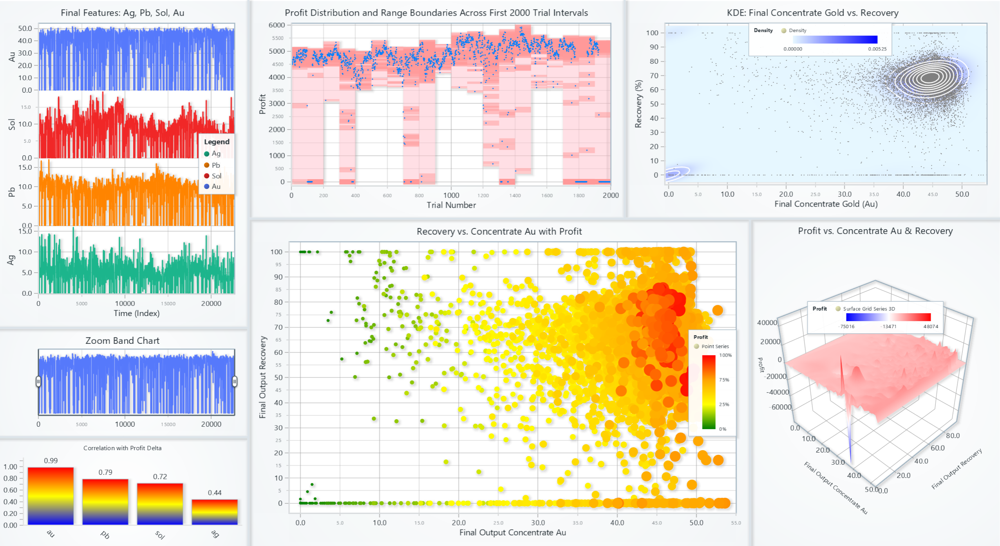

# Predicting Gold Recovery Application with LightningChart Python

## Introduction

This project shows data visualization and machine learning analytics to optimize industrial gold recovery processes. In this project we aimed to show how integrating machine learning models with interactive visualization capabilities gives us real-time insights to make operational decisions. The main goal is to predict gold recovery and optimize profit using real-time visualizations.

**LightningChart Python**

LightningChart Python is a powerful visualization library that is capable of visualizing real-time and interactive charts with large datasets efficiently in industrial applications. Its advanced charts such as heatmaps, bubble charts, real-time line and area charts, and 3D visualizations provided visual insight into gold recovery data analysis.

**Reviewing Libraries**

Several Python libraries were employed in this article:

- **Pandas:** For loading, cleaning, and structuring data.
- **NumPy:** For numerical operations.
- **scipy & scikit-learn:** Provided machine learning techniques like KDE (Kernel Density Estimation), Random Forest regression modeling, and SMOGN for synthetic minority oversampling.
- **trimesh:** For processing and visualizing 3D mesh models.

## Setting Up Python Environment
To start working on this project, we need to set up the Python environment with necessary libraries.

### Installing Python and Necessary Libraries

Before running the project, install Python and the other required libraries using:
   ```bash
   pip install pandas numpy scipy scikit-learn smogn trimesh lightningchart
   ```
### Setting Up the Development Environment
1. Set up a virtual environment:
```bash
python -m venv env
source env/bin/activate  # On Windows use `env\Scripts\activate`
```
2. Use **Visual Studio Code (VSCode)** for a streamlined development experience.

---

## Visualizing Data with LightningChart
### Creating the Charts
Here are some examples codes and charts that shows how we created key visualizations:

#### **Static Dashboard Visualization**

In the dashboard, we could see different charts that help us to have a better understanding of the dataset. In the first Multi Y-axis chart**,** we can see final concentrate features (gold, solid, lead**,** and Silver) across the dataset index. To explore the data better through smaller regions in the chart**,** I added a zoom band chart. In the Bar Chart**,** we could see how changes in each concentrate feature are correlated with changes in profit. Here first I calculated the difference between two consecutive trial numbers, and it can be seen that fluctuations in gold values during the experiment are more correlated with profit changes than other parameters. In this Scatter-Rectangle Series**,** we can see profit versus trial number for the first 2000 trials**. I** showed profit bands with a semi-transparent pink rectangle for each 100 trial interval to highlight min/max profit**,** and we have another smaller red rectangle around each profit point to show profits better. In the Bubble Chart, we have on the x-axis final concentrate gold (Au), final output recovery on the Y-axis, and bubble size/color showing profit. In the Contour Plot, we can see a 2D heatmap of data density regions of final concentration gold and gold recovery (It shows where points are most concentrated). We also have contour lines and scatter points**,** and finally**,** in the 3D Surface**,** we can see how profit changes with gold concentration and recovery.

```python
df = pd.read_csv("gold_recovery_full_with_profit.csv")
df["time"] = df.index.astype(float)

dashboard = lc.Dashboard(rows=5, columns=8)

chart_final = dashboard.ChartXY(...)
series = chart_final.add_line_series(...)
series.append_samples(x_values=df['time'], y_values=df[col])

correlation_data = [{"category": "au", "value": 0.99}, ...]
chart_corr.set_data(correlation_data)

bubble = chart_bubble.add_point_series(sizes=True, lookup_values=True)
bubble.append_samples(x_values=..., y_values=..., sizes=..., lookup_values=...)

heatmap_series = chart_kde.add_heatmap_grid_series(...)
surface_series = chart3d.add_surface_grid_series(...)
```



#### **Dynamic 3D Ore and Tail Visualization**

In this Real-Time streaming dashboard as we can see in the first row, color changing in each feature shows its concentration level and below them we can see their concentration value. Similarly, we have the same thing for each feature concentration level in the tailing after processing. In the bottom we have multi y-axis line chart shows how profit and final output gold recovery are related to each other.

```python
vertices, indices, normals = trimesh.load_mesh("rock.OBJ")
model.set_model_geometry(vertices, indices, normals)

model.set_color(lerp_color(start_color, end_color, factor))
tail_model.set_scale(base_scale + scale_range * factor_tail)

txtbox.set_text(f"{name} Value: {value:.2f}")

recovery_series.add(x=[i], y=[recovery])
profit_series.add(x=[i], y=[profit])
```


#### **Real-Time Prediction and Uncertainty Visualization**

In this dashboard, we can see different ways of visualizing uncertainty in the first two rows. At the bottom, the chart first starts by predicting two values and connecting them with a red line. After a few seconds, it shows the actual values with a cyan line, and at the same time, the model turns the old red line to orange and starts predicting new values and connecting them.

```python
rf = RandomForestRegressor(...)
rf.fit(X_train, y_train)

median_prediction = np.median([tree.predict(X_test) for tree in rf.estimators_], axis=0)

series_5th_95th.add_dict_data([{'position': x, 'low': p5, 'high': p95}])
heatmap_data[:, i] = generate_uncertainty_heatmap(...)
actual_series.add_samples(x=[t], y=[actual]
```

  

#### **Interactive Mixing Plan Dashboard**

In this Real-Time streaming dashboard, in the first column, we can see profit, gold, solid, lead, and silver changes against the trial number. Minima or maxima in profit are marked with green stars, which show spikes, and red stars, which show dips in the trend, respectively. I applied a sleep time of about four seconds to let the bar chart update so the user can follow changes more easily. On the right side, the waterfall chart shows how each concentrate feature and profit changed between the current star and the previous star. It helps us see which features have more impact on profit at each star event. At the bottom, we can see a set of text boxes and icons showing the best feature-change combination we have so far.

```python
for y_col in y_columns:
    line_series = chart.add_line_series(...)
    line_series.add([x], [y])

if prev_profit < next_profit:
    min_star_series.add([x], [y])
    waterfall_data = [{"category": "ag", "value": delta_ag}, ...]

best_combo_textboxes["profit"].set_text("profit: 191.01")
tb_icon.add_image("up2.png")
```

  

**Conclusion**

In conclusion, this Predicting Gold Recovery application shows how to combine machine learning methods with the powerful visualization tools provided by LightningChart Python. The visual analytics dashboards give us better insight into profit dynamics, feature importance, and uncertainty prediction. LightningChart Python significantly improves data interaction, allowing us to quickly interpret real-time predictive analytics, that is really important for optimizing industrial gold recovery processes.

